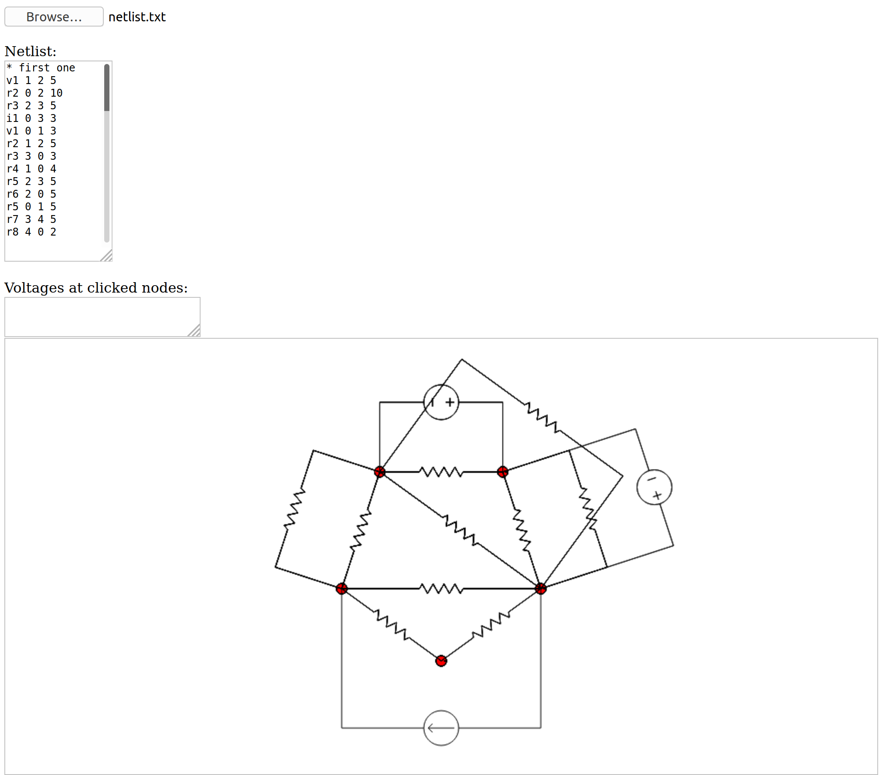

# Circuit-solver

This is a web-based circuit simulator which imports a netlist as a text file (<a href="netlist.txt">netlist.txt</a> is a sample), solves the circuit, and displays a schematic diagram for the circuit.  
The nodes as mentioned in the netlist are shown as red circles. The voltage at a particular node is displayed when that node is clicked.

The circuit is solved using <a href="https://www.swarthmore.edu/NatSci/echeeve1/Ref/mna/MNA3.html">modified nodal analysis</a>. The circuit may only contain ideal, independent, constant current and voltage sources, and resistors. I hope to include these too, soon. 

To run this circuit solver, download or copy-paste the contents of <a href="ckt_solver.html">ckt_solver.html</a>, and open it in a web browser. You should see something like this- 

Click on Browse and import the text file containing the netlist. The contents of the file are displayed and a circuit diagram is displayed- 

Now simply click on the nodes and the voltage at that particular node will be displayed like so-

